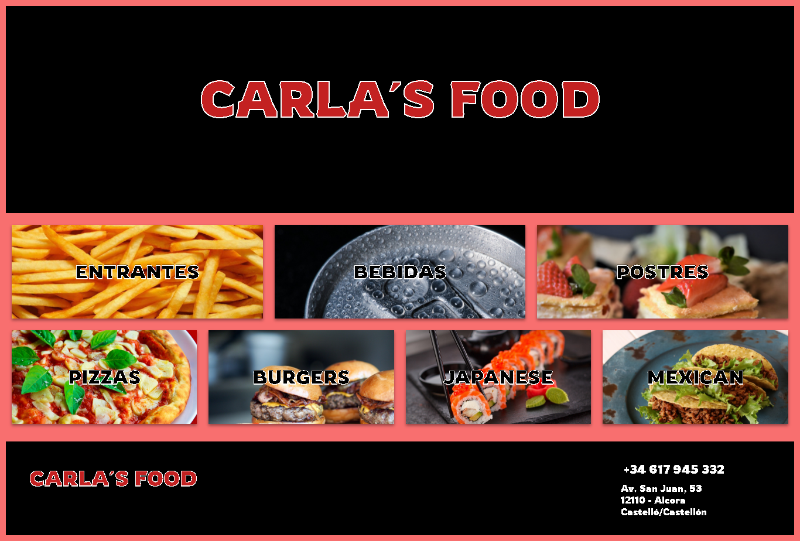
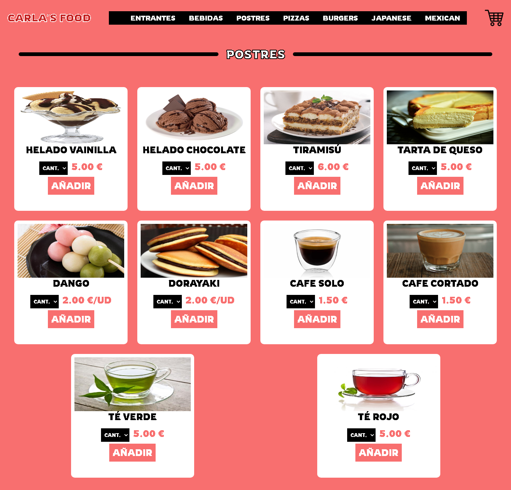

# Carla´s Food App
## _An app that delivers orders by mail_





## Features
- ✨Magic ✨
- Add orders in a JSON file
- Delete orders in a JSON file
- Save orders in a JSON file


## Tech

"Carla's Food" uses the following technologies

- [pug] - template engine for nodejs
- [node.js] - evented I/O for the backend
- [Express] - fast node.js network app framework [@tjholowaychuk]
- [json] - duh

And of course Dillinger itself is open source with a [public repository][dill]
 on GitHub.

## Installation

Carla´s Food requires [Node.js](https://nodejs.org/) v10+ to run.

Install the dependencies and devDependencies and start the server.

```sh
cd carlas-food
npm i
```

## Run
```sh
nodemon start
```


## License

GNU General Public License v2.0

   [node.js]: <http://nodejs.org>
   [express]: <http://expressjs.com>
   [pug]: <https://pugjs.org/>
